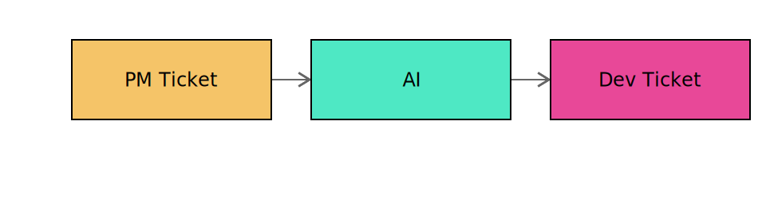

[](https://github.com/StephanSchmidt/human/actions/workflows/ci.yml)
[](https://codecov.io/gh/StephanSchmidt/human)
[](https://goreportcard.com/report/github.com/stephanschmidt/human)
[](https://pkg.go.dev/github.com/stephanschmidt/human)
[](https://github.com/StephanSchmidt/human/releases/latest)
[](https://github.com/StephanSchmidt/human/network/updates)
[](https://github.com/StephanSchmidt/human/blob/main/LICENSE)

# human

[https://gethuman.sh](https://gethuman.sh)

**Human in the loop —** Issue tracker CLI for AIs. Reads and manages issues across Jira, GitHub, GitLab, Linear, Azure DevOps, and Shortcut with output as JSON and markdown.

- **One CLI for Jira, GitHub, GitLab, Linear, Azure DevOps, and Shortcut** — no tool-switching for the AI
- **JSON and markdown output** — pipe directly into LLMs - LLMs can work with it
- **Claude Code skills** turn PM tickets into implementation plans and bug analyses
- **Definition of Ready checks** AI catches incomplete tickets before coding starts

### Why

As AI agents write more code autonomously, the question becomes: who decides *what* gets built? With `human`, an AI reads a product ticket from the issue tracker, creates an implementation ticket with a plan, and a human reviews it before coding starts. That's the human in the loop — and that's the pun.



## Claude Code usage

Install the Claude Code skills and agents into your project:

```bash
human install --agent claude
```

This writes skill and agent files to `.claude/` in the current directory. Re-run after upgrading `human` to pick up changes.

### Check ticket readiness

The `/human-ready` skill fetches a ticket, evaluates it against a Definition of Ready checklist, and asks you to fill in any gaps. The result is saved for reference.

In Claude Code:

```
/human-ready KAN-1
```

The skill checks six criteria: clear description, acceptance criteria, scope, dependencies, context, and edge cases. For anything missing or incomplete, it asks you to provide the information. The completed assessment is written to `.human/ready/kan-1.md`.

### Create an implementation plan

The `/human-plan` skill fetches a ticket, explores the codebase, and produces a structured implementation plan.

```
/human-plan KAN-1
```

The plan is written to `.human/plans/kan-1.md`.

### Analyze a bug

The `/human-bug-plan` skill fetches a bug ticket (including comments for stack traces and logs), explores the codebase for root cause, and writes a structured bug analysis with a fix plan.

```
/human-bug-plan KAN-1
```

The analysis is written to `.human/bugs/kan-1.md`.

## Install

```bash
curl -sSfL gethuman.sh/install.sh | bash
```

Or with Homebrew:

```bash
brew install stephanschmidt/tap/human
```

Or with Go:

```bash
go install github.com/stephanschmidt/human@latest
```

## CLI usage

Commands output JSON by default for easy piping to scripts and LLMs. Use `--table` for human-readable output. The same commands work across Jira, GitHub, GitLab, Linear, Azure DevOps, and Shortcut — only the project identifier changes.

```bash
# List issues (JSON by default)
human issues list --project=KAN                    # Jira
human issues list --project=octocat/hello-world    # GitHub
human issues list --project=mygroup/myproject      # GitLab
human issues list --project=ENG                    # Linear
human issues list --project=Human                  # Azure DevOps
human issues list --project=MyProject              # Shortcut

# Human-readable table
human issues list --project=KAN --table

# Get a single issue as markdown
human issue get KAN-1
human issue get octocat/hello-world#42
human issue get mygroup/myproject#42
human issue get ENG-123
human issue get Human/42                           # Azure DevOps
human issue get 123                                # Shortcut

# Create an issue
human issue create --project=ENG "Implement feature"

# Add a comment to an issue
human issue comment add KAN-1 "This is done"

# List comments on an issue
human issue comment list KAN-1

# Use a named tracker instance from .humanconfig.yaml
human --tracker=work issues list --project=KAN
```

## Setup

```bash
cp .humanconfig.example .humanconfig.yaml
# edit .humanconfig.yaml with your tracker instances
```

## Build

```bash
make build
```

## Configuration

`.humanconfig.yaml` holds named tracker instances. Multiple instances per tracker are supported. By default the first entry is used; select a specific one with `--tracker`:

```yaml
jiras:
  - name: work
    url: https://work.atlassian.net
    user: me@work.com
    key: api-token

githubs:
  - name: personal
    token: ghp_xxx

gitlabs:
  - name: work
    token: glpat-xxx

linears:
  - name: work
    token: lin_xxx

azuredevops:
  - name: work
    org: myorg
    token: pat-xxx

shortcuts:
  - name: work
    token: xxx
```

Select a specific instance with `--tracker`:

```bash
human --tracker=personal issues list --project=KAN
human --tracker=work issues list --project=octocat/hello-world
```

When only one tracker type is configured, it is auto-detected. When multiple tracker types are configured, specify which one with `--tracker=<name>`.

List all configured trackers (JSON output, also the default when run without arguments):

```bash
human tracker list
```

### Settings resolution

Each setting is resolved in priority order (highest wins):

1. **CLI flags** (e.g. `--jira-url`)
2. **Global env vars** (e.g. `JIRA_URL`)
3. **Per-instance env vars** (e.g. `JIRA_WORK_URL` — name uppercased)
4. **`.humanconfig.yaml`** — selected entry fills remaining gaps

| Tracker | Env prefix | Settings | Default URL |
|---------|-----------|----------|-------------|
| Jira | `JIRA_` | `URL`, `USER`, `KEY` | — |
| GitHub | `GITHUB_` | `URL`, `TOKEN` | `https://api.github.com` |
| GitLab | `GITLAB_` | `URL`, `TOKEN` | `https://gitlab.com` |
| Linear | `LINEAR_` | `URL`, `TOKEN` | `https://api.linear.app` |
| Azure DevOps | `AZURE_` | `URL`, `ORG`, `TOKEN` | `https://dev.azure.com` |
| Shortcut | `SHORTCUT_` | `URL`, `TOKEN` | `https://api.app.shortcut.com` |
