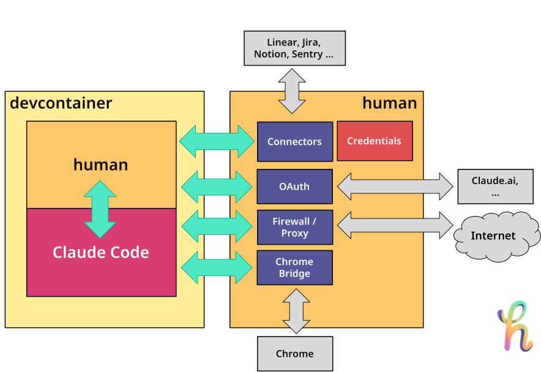

[](https://github.com/StephanSchmidt/human/actions/workflows/ci.yml)
[](https://codecov.io/gh/StephanSchmidt/human)
[](https://goreportcard.com/report/github.com/StephanSchmidt/human)
[](https://pkg.go.dev/github.com/StephanSchmidt/human)
[](https://github.com/StephanSchmidt/human/releases/latest)
[](https://github.com/StephanSchmidt/human/network/updates)
[](https://github.com/StephanSchmidt/human/blob/main/LICENSE)

# human

[https://gethuman.sh](https://gethuman.sh)

**The everything framework for AI development.** Claude is the engine. human is everything else. One tool. One install. Everything works.

- Connectors to issue trackers, documentation in a secure way
- Open URLS in devcontainers
- MCP OAuth callbacks in devcontainers
- Firewall/Proxy for devcontainers
- Chrome-Claude Code Bridge from inside devcontainers
- Alls the skills you need for development

### Architecture



## Install

```bash
curl -sSfL gethuman.sh/install.sh | bash
```

Or with Homebrew:

```bash
brew install stephanschmidt/tap/human
```

Or with [mise](https://mise.jdx.dev):

```bash
mise use -g github:StephanSchmidt/human
```

Or with Go:

```bash
go install github.com/StephanSchmidt/human@latest
```

Or add as a [devcontainer Feature](https://github.com/StephanSchmidt/treehouse):

```json
{ "features": { "ghcr.io/stephanschmidt/treehouse/human:1": {} } }
```

## CLI usage

Use `--table` for human-readable output. Quick commands auto-detect the tracker from key format and configuration:

```bash
# Quick commands (auto-detect tracker)
human get KAN-1                                          # get a single issue
human list --project=KAN                                 # list issues in a project
human list --project=KAN --tracker=work                  # disambiguate with --tracker
```

The same commands also work in provider-specific form — only the project identifier changes:

```bash
# List issues (JSON by default)
human jira issues list --project=KAN                    # Jira
human github issues list --project=octocat/hello-world  # GitHub
human gitlab issues list --project=mygroup/myproject    # GitLab
human linear issues list --project=ENG                  # Linear
human azuredevops issues list --project=Human           # Azure DevOps
human shortcut issues list --project=MyProject          # Shortcut

# Human-readable table
human jira issues list --project=KAN --table

# Get a single issue as markdown
human jira issue get KAN-1
human github issue get octocat/hello-world#42
human gitlab issue get mygroup/myproject#42
human linear issue get ENG-123
human azuredevops issue get Human/42                    # Azure DevOps
human shortcut issue get 123                            # Shortcut

# Create an issue
human linear issue create --project=ENG "Implement feature" --description "Feature details in markdown"

# Add a comment to an issue
human jira issue comment add KAN-1 "This is done"

# List comments on an issue
human jira issue comment list KAN-1

# Use a named tracker instance from .humanconfig.yaml
human --tracker=work jira issues list --project=KAN

# Notion — search, read pages, query databases
human notion search "quarterly report"
human notion page get <page-id>
human notion databases list --table
human notion database query <database-id> --table

# Use a named Notion instance
human notion --notion=work search "meeting notes"

# Figma — browse files, inspect nodes, read comments
human figma file get <file-key>
human figma file comments <file-key>
human figma file components <file-key>
human figma file nodes <file-key> --ids=0:1,1:2
human figma file image <file-key> --ids=0:1
human figma projects list --team=<team-id>
human figma project files <project-id>

# Use a named Figma instance
human figma --figma=design file get <file-key>

# Amplitude — product analytics
human amplitude events list
human amplitude events query --event=_active --start=20260301 --end=20260311
human amplitude taxonomy events
human amplitude funnel --events=signup,purchase --start=20260301 --end=20260311
human amplitude retention --start-event=signup --return-event=login --start=20260301 --end=20260311
human amplitude user search alice@example.com
human amplitude cohorts list

# Use a named Amplitude instance
human amplitude --amplitude=product events list
```

## Devcontainer / Remote mode

AI agents running inside devcontainers need access to issue trackers, Notion, Figma, and Amplitude, but credentials should stay on the host. The daemon mode splits `human` into two roles: a **daemon** on the host (holds credentials, executes commands) and a **client** inside the container (forwards CLI args, prints results). You need `human` installed on both sides: on the host (via Homebrew, curl, etc.) to run the daemon, and inside the container (via the devcontainer Feature) as the client. It's the same binary — the mode is determined by the `HUMAN_DAEMON_ADDR` environment variable.

On the host:

```bash
human daemon start          # prints token, listens on :19285
human daemon token          # print token for copy/paste
human daemon status         # check if daemon is reachable
```

In `devcontainer.json`, add the [devcontainer Feature](https://github.com/StephanSchmidt/treehouse) to install `human` and configure the daemon connection:

```json
{
  "features": {
    "ghcr.io/stephanschmidt/treehouse/human:1": {}
  },
  "forwardPorts": [19285, 19286],
  "remoteEnv": {
    "HUMAN_DAEMON_ADDR": "localhost:19285",
    "HUMAN_DAEMON_TOKEN": "<paste from 'human daemon token'>",
    "HUMAN_CHROME_ADDR": "localhost:19286"
  }
}
```

Inside the container, all commands work transparently:

```bash
human jira issues list --project=KAN       # forwarded to host daemon
human figma file get ABC123                # forwarded to host daemon
human notion search "quarterly report"     # forwarded to host daemon
```

### Chrome bridge

When using Claude Code inside a devcontainer, the Chrome MCP bridge needs a Unix socket that Claude can discover. The `chrome-bridge` command creates this socket and tunnels traffic to the daemon on the host.

```bash
human chrome-bridge                        # daemonizes, prints PID and socket path
```

The command starts in the background by default — it prints the PID, socket path, and log location, then returns control to the terminal so you can run `claude` in the same shell:

```bash
human chrome-bridge
claude                                     # runs immediately after
```

The bridge requires `HUMAN_CHROME_ADDR` and `HUMAN_DAEMON_TOKEN` environment variables (included in the `devcontainer.json` example above).

Use `--foreground` to run the bridge in blocking mode (useful for debugging):

```bash
human chrome-bridge --foreground           # blocks, logs to stderr
```

Logs are written to `~/.human/chrome-bridge.log`.

When `HUMAN_DAEMON_ADDR` is not set, `human` runs in standalone mode — no daemon required.

### HTTPS proxy

The daemon includes a transparent HTTPS proxy on port 19287 that filters outbound traffic from devcontainers by domain. It reads the SNI from TLS ClientHello — no certificates needed, no traffic decryption.

Configure allowed domains in `.humanconfig.yaml`:

```yaml
proxy:
  mode: allowlist    # or "blocklist"
  domains:
    - "*.github.com"
    - "api.openai.com"
    - "registry.npmjs.org"
```

- `allowlist`: only listed domains pass, everything else blocked
- `blocklist`: only listed domains blocked, everything else passes
- No `proxy:` section: block all (safe default)

Enable in `devcontainer.json` using the [treehouse](https://github.com/StephanSchmidt/treehouse) devcontainer Feature:

```json
{
  "features": {
    "ghcr.io/stephanschmidt/treehouse/human:1": {
      "proxy": true
    }
  },
  "capAdd": ["NET_ADMIN"],
  "remoteEnv": {
    "HUMAN_DAEMON_ADDR": "localhost:19285",
    "HUMAN_DAEMON_TOKEN": "<paste from 'human daemon token'>",
    "HUMAN_CHROME_ADDR": "localhost:19286",
    "HUMAN_PROXY_ADDR": "${localEnv:HUMAN_PROXY_ADDR}"
  },
  "forwardPorts": [19285, 19286],
  "postStartCommand": "sudo human-proxy-setup"
}
```

See the [treehouse README](https://github.com/StephanSchmidt/treehouse#https-proxy) for full setup instructions. The `test-devcontainer/` directory in treehouse provides a working example you can use as a starting point.

## Claude Code usage

Install the Claude Code skills and agents into your project:

```bash
human install --agent claude
```

This writes skill and agent files to `.claude/` in the current directory. Re-run after upgrading `human` to pick up changes.

### Check ticket readiness

The `/human-ready` skill fetches a ticket, evaluates it against a Definition of Ready checklist, and asks you to fill in any gaps. The result is saved for reference.

In Claude Code:

```
/human-ready KAN-1
```

The skill checks six criteria: clear description, acceptance criteria, scope, dependencies, context, and edge cases. For anything missing or incomplete, it asks you to provide the information. The completed assessment is written to `.human/ready/kan-1.md`.

### Brainstorm approaches

The `/human-brainstorm` skill explores the codebase, asks clarifying questions one at a time, and generates 2-3 implementation approaches with trade-offs. You pick the approach, and the result is saved for reference.

```
/human-brainstorm KAN-1
/human-brainstorm "add caching layer for API responses"
```

The brainstorm is written to `.human/brainstorms/<identifier>.md`. Run `/human-plan` next to turn the chosen approach into a concrete implementation plan.

### Create an implementation plan

The `/human-plan` skill fetches a ticket, explores the codebase, and produces a structured implementation plan.

```
/human-plan KAN-1
```

The plan is written to `.human/plans/kan-1.md`.

### Analyze a bug

The `/human-bug-plan` skill fetches a bug ticket (including comments for stack traces and logs), explores the codebase for root cause, and writes a structured bug analysis with a fix plan.

```
/human-bug-plan KAN-1
```

The analysis is written to `.human/bugs/kan-1.md`.

### Execute a plan

The `/human-execute` skill loads an existing plan, executes it step by step, and runs a review checkpoint to verify the result.

```
/human-execute KAN-1
```

Requires a plan at `.human/plans/kan-1.md` (create one first with `/human-plan`).

### Review changes against a ticket

The `/human-review` skill diffs the current branch against the default branch and evaluates every change against the ticket's acceptance criteria. It flags missing criteria, scope creep, and unhandled edge cases.

```
/human-review KAN-1
```

The review is written to `.human/reviews/kan-1.md`.

### Check if a ticket is done

The `/human-done` skill runs tests, checks each acceptance criterion against the implementation, and produces a structured pass/fail Definition of Done report.

```
/human-done KAN-1
```

The report is written to `.human/done/kan-1.md`.

### Scan for bugs

The `/human-findbugs` skill scans the codebase for bugs using a multi-agent pipeline. It auto-detects technologies and uses concern-based analysis agents to find semantic bugs that static analysis tools miss — logic errors, error handling gaps, race conditions, and security vulnerabilities.

```
/human-findbugs
```

No ticket needed. The skill runs three phases: reconnaissance, deep analysis (4 parallel agents), and triage. The final report is written to `.human/bugs/findbugs-<timestamp>.md`.

### Security audit

The `/human-security` skill performs a deep security audit of the codebase using a 4-phase pipeline with 8 specialized agents. It auto-detects technologies, maps the attack surface, runs 5 parallel scanning agents (injection, auth, secrets, dependencies, infrastructure), builds multi-step attack chains connecting individual findings into exploitable paths, then triages everything with OWASP Top 10 coverage.

```
/human-security
```

No ticket needed. The final report is written to `.human/security/security-<timestamp>.md`.

## Setup

The fastest way to get started:

```bash
human init
```

The interactive wizard lets you pick trackers and tools, then writes `.humanconfig.yaml` and prints the environment variables to set. It can also install the Claude Code integration.

Alternatively, configure manually:

```bash
cp .humanconfig.example .humanconfig.yaml
# edit .humanconfig.yaml with your tracker instances
```

## Configuration

Add trackers and tools to `.humanconfig.yaml`:

```yaml
# Issue trackers
jiras:
  - name: work
    url: https://work.atlassian.net
    user: me@work.com
    key: your-api-token

githubs:
  - name: oss
    token: ghp_abc123

# Tools
notions:
  - name: work
    token: ntn_abc123
    description: Company workspace

figmas:
  - name: design
    token: figd_abc123
    description: Product design team

amplitudes:
  - name: product
    url: https://analytics.eu.amplitude.com  # EU; US default: https://amplitude.com
    description: Product analytics
    # key + secret from env
```

Notion tokens can also be set via environment variables: `NOTION_TOKEN` (global) or `NOTION_<NAME>_TOKEN` (per-instance).

Figma tokens can also be set via environment variables: `FIGMA_TOKEN` (global) or `FIGMA_<NAME>_TOKEN` (per-instance).

Amplitude credentials can also be set via environment variables: `AMPLITUDE_KEY` + `AMPLITUDE_SECRET` (global) or `AMPLITUDE_<NAME>_KEY` + `AMPLITUDE_<NAME>_SECRET` (per-instance).

See [documentation.md](docs/documentation.md) for full configuration details including environment variables and settings resolution.

## Build

```bash
make build
```
